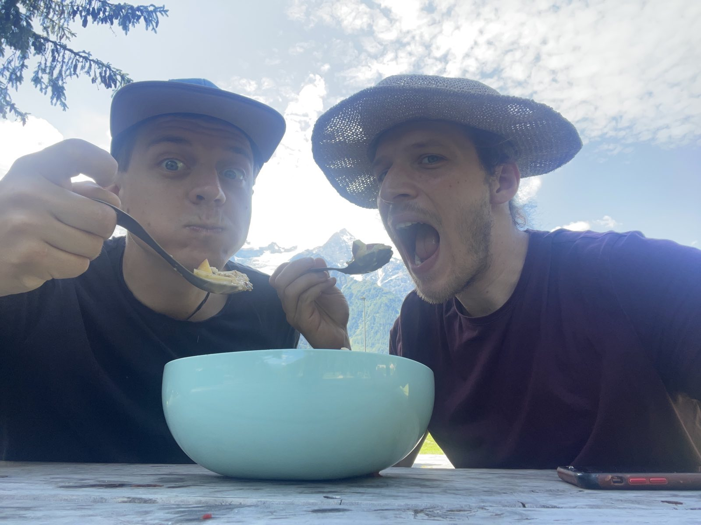
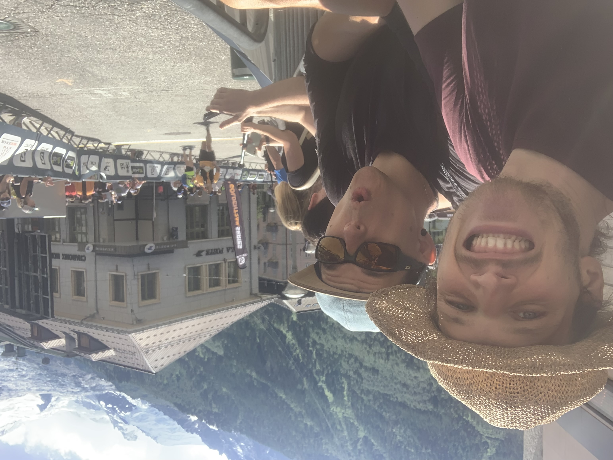
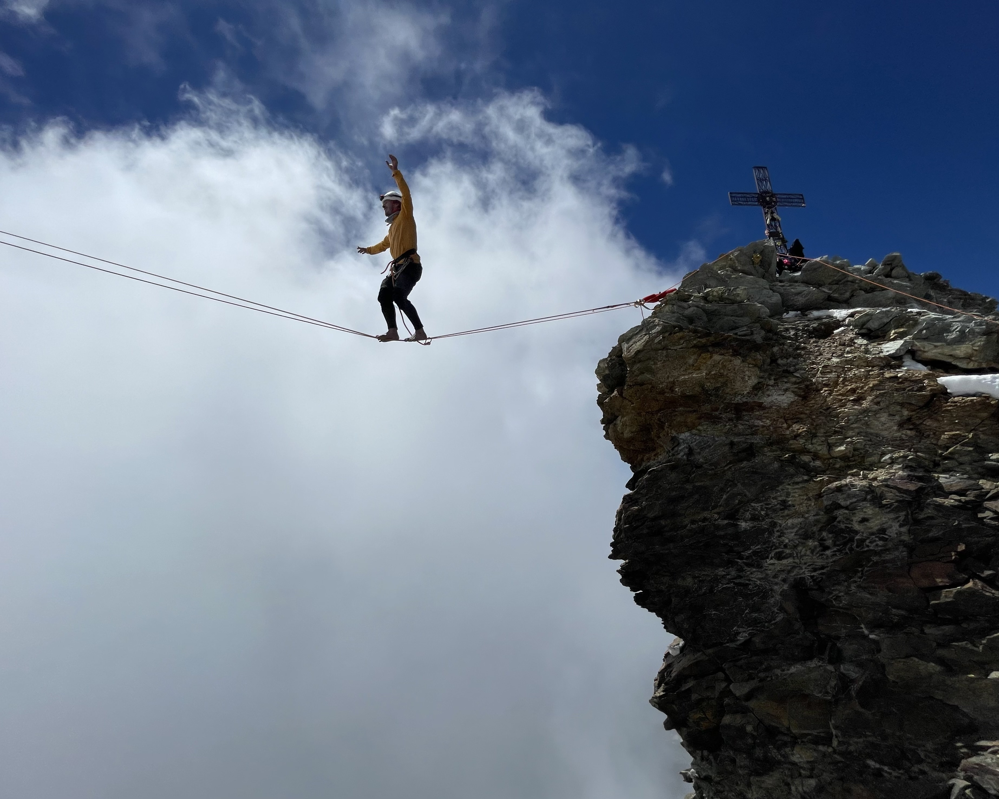

# Klettergebietstour Deluxe

## Die Idee

Alle 13 Klettergebiete der Sächsischen Schweiz an einem einzigen Tag besuchen und in jedem Gebiet eine ikonische Route klettern. Zu Fuß. Ohne Auto, Fahrrad oder andere Hilfsmittel. Alles was wir brauchen, tragen wir selbst.

> **80 km | 2.200 Hm | 13 Gipfel | 24 Stunden**

Die Tour soll in der Woche der Sommersonnenwende 2027 stattfinden, wenn die Tage am längsten und die Bedingungen am besten sind.

---

## Wer sind wir

**Peter Bessler** ist Industriekletterer und Unternehmer aus Leipzig. Er hat das Klettern in der Sächsischen Schweiz vor über 20 Jahren für sich entdeckt und ist seitdem regelmäßig in den Gebieten unterwegs.

**Jens Decke** ist Ingenieur und Guinness-Weltrekordhalter aus Eschwege.

Wir sind seit vielen Jahren über den Bergsport und insbesondere das Highlining eng verbunden. Unsere Leidenschaft ist es, Sportarten miteinander zu verbinden und so einzigartige Erlebnisse zu schaffen: Trailrunning, Bergsteigen, Klettern, Slacklinen.

### Matterhorn-Projekt

Unser bisher größtes gemeinsames Projekt war die Besteigung des Matterhorns (4.478 m) von Cervinia aus. In einem einzigen Tag sind wir aufgestiegen und haben auf dem italienischen Gipfel eine Highline-Begehung gemacht.

---

## Die Herausforderung

Was die Klettergebietstour Deluxe so besonders macht: Es geht nicht nur um die 80 Kilometer und 2.200 Höhenmeter. Es geht darum, nach stundenlangem Laufen durch die Nacht noch konzentriert genug zu sein, um an einem Sandsteinturm sicher zu klettern. Und das 13 Mal.

Die Route führt von Hinterhermsdorf durch den Großen und Kleinen Zschand, über die Affensteine und Schrammsteine bis ins Bielatal. Jeder Gipfel muss bestiegen und jede Route sauber geklettert werden, egal wie müde wir sind.

---

## Was brauchen wir

### Sponsoring & Unterstützung

- **Ausrüstung**: Kletterausrüstung, Trailrunning-Schuhe, Stirnlampen, Verpflegung
- **Finanzielle Unterstützung**: für Vorbereitung, Logistik und Dokumentation
- **Dokumentationsteam**: Kamerateam für einen Projektfilm und Promo-Material

### Was wir bieten

- Logoplatzierung im Projektfilm und auf allen Social-Media-Kanälen
- Erwähnung in Presse- und Medienberichten
- Gemeinsame Content-Erstellung vor, während und nach der Tour

---

## Kontakt

<!-- Kontaktdaten hier ergänzen: E-Mail, Instagram, Website etc. -->
